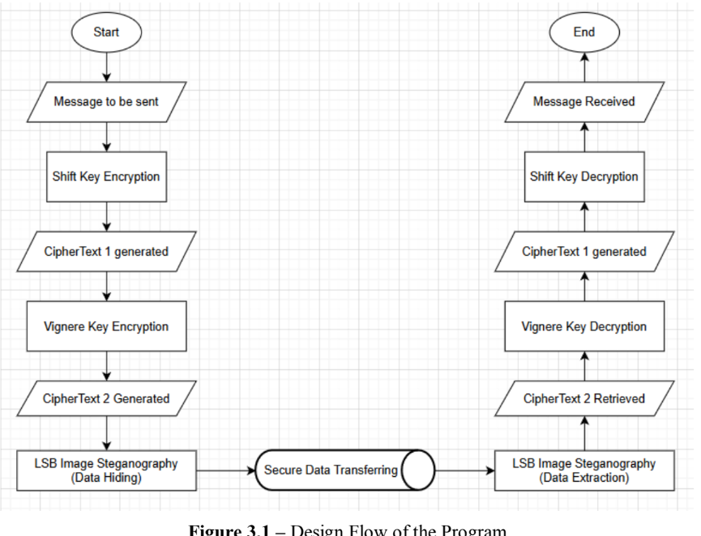

# StegaCrypt Chat

<div align="center">
  <a href="https://reactjs.org/">
    
  </a>
  <a href="https://www.typescriptlang.org/">
    
  </a>
  <a href="https://vitejs.dev/">
    
  </a>
  <a href="https://supabase.io/">
    
  </a>
  <a href="https://tailwindcss.com/">
    
  </a>
</div>

<br>

A secure, real-time messaging application featuring a unique hybrid security model of end-to-end encryption and steganography.

<div align="center">
  
</div>

## About The Project

StegaCrypt Chat is a full-stack web application designed for users who prioritize privacy and security in their communications. It goes beyond standard messaging apps by implementing a dual-layered security approach: all text messages are end-to-end encrypted, and users also have the ability to conceal their encrypted messages within the data of an image file (steganography), making the communication itself difficult to detect.

The application is built with a modern tech stack, leveraging the power of React for the frontend and Supabase for a scalable, real-time backend.

## ✨ Features

- **Real-Time Messaging:** Instant message delivery for one-on-one and group conversations.
- **Hybrid Security Model:**
  - **End-to-End Encryption (E2EE):** All standard text messages are encrypted on the client-side, ensuring only the sender and recipient can read them.
  - **Steganography:** A unique feature to hide encrypted text within a cover image, providing an extra layer of deniability and security.
- **User Authentication:** Secure user registration and login handled by Supabase Auth.
- **Chat Management:** Create new one-on-one chats or multi-user groups.
- **Creator-Only Controls:** Only the user who created a chat can delete it, enforced by PostgreSQL Row Level Security (RLS).
- **Bulk Message Deletion:** Users can select multiple messages they've sent and delete them in a single action.
- **User Search:** Find and start conversations with other registered users.
- **Presence System:** See which users are currently online.

## 🛠️ Tech Stack

### Frontend
- **Framework:** React
- **Language:** TypeScript
- **Build Tool:** Vite
- **Styling:** Tailwind CSS
- **Icons:** Lucide React

### Backend & Database
- **Platform:** Supabase
- **Database:** PostgreSQL
- **Authentication:** Supabase Auth
- **Real-time API:** Supabase Realtime Subscriptions
- **Serverless Logic:** PostgreSQL Functions (RPC)

## 🔐 Security Model

The security of StegaCrypt Chat is its most important feature, based on two client-side principles:

1.  **End-to-End Encryption:** Using a combination of Caesar Cipher shifts and a Vigenère Cipher, a multi-layered encryption key is generated on the client-side for each message. This ensures that the message content stored in the database is completely unreadable without the specific keys, which are only ever held by the clients in the chat.

2.  **Steganography:** As an alternative sending method, the fully encrypted ciphertext is embedded into the pixel data of a randomly chosen cover image. To other users, it appears as a simple image transfer, while authorized clients can extract and decrypt the hidden message, providing plausible deniability. The cover image itself is never displayed in the chat.

## 🚀 Getting Started

To get a local copy up and running, follow these simple steps.

### Prerequisites

- Node.js (v16 or later)
- `npm` or `yarn`
- A free [Supabase](https://supabase.io/) account

### Installation

1.  **Clone the repository:**
    ```sh
    git clone [https://github.com/Sumer3018/Cryptichat]
    ```

2.  **Install NPM packages:**
    ```sh
    npm install
    ```

3.  **Set up your Supabase project:**
    - Create a new project on [supabase.com](https://supabase.com).
    - Go to the **SQL Editor** and run the SQL scripts for creating your tables (`chats`, `profiles`, `messages`, `chat_participants`) and the required RPC functions (`get_my_chats`, `delete_my_messages`, etc.).
    - Go to **Authentication -> Policies** and enable Row Level Security (RLS) on all tables, then add the necessary policies for secure data access.

4.  **Configure Environment Variables:**
    - In the Supabase dashboard, go to **Project Settings -> API**.
    - Find your **Project URL** and `anon` **(public) API Key**.
    - Create a `.env` file in the root of your project folder.
    - Add your Supabase credentials to the `.env` file:
      ```env
      VITE_SUPABASE_URL=YOUR_PROJECT_URL
      VITE_SUPABASE_ANON_KEY=YOUR_ANON_KEY
      ```

5.  **Run the application:**
    ```sh
    npm run dev
    ```

The application should now be running on `http://localhost:5173` (or the port specified in your console).
